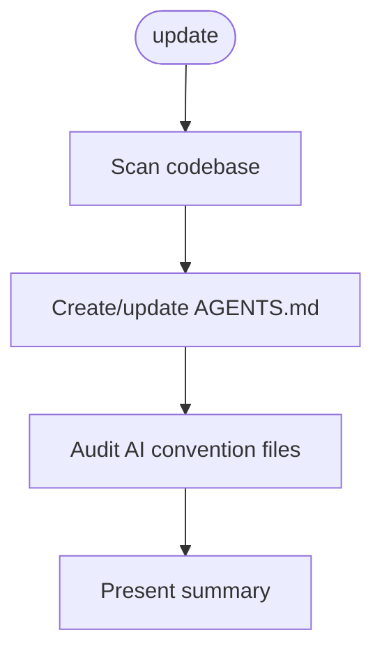

<!-- Edited by Claude Code -->
# AI-Ready

Keep a project AI-friendly by maintaining accurate `AGENTS.md` files and a clean set of AI convention files.

## Phase Flow



## What It Does

The `/ai-ready:update` command scans a codebase and:

1. **Creates or updates `AGENTS.md`** at the project root with project-specific instructions — build commands, test procedures, code style, architecture, and conventions
2. **Audits AI convention files** (`.cursorrules`, `CLAUDE.md`, `.github/copilot-instructions.md`, etc.) — keeps tool-specific ones, merges redundant ones into `AGENTS.md`, updates stale ones
3. **Detects monorepos** and recommends nested `AGENTS.md` files for subprojects

## When to Run

- **First time**: When onboarding a project without an `AGENTS.md`
- **After changes**: After significant codebase changes (new dependencies, restructured directories)
- **Periodic audit**: To verify AI convention files are accurate and not redundant

## How It Works

1. Checks for existing `AGENTS.md` and scans for all AI convention files
2. Analyzes the codebase: package manifests, CI configs, linting, tests, build scripts
3. Creates `AGENTS.md` from scratch or applies surgical updates
4. Audits other AI convention files — keeps tool-specific ones, merges redundant ones
5. Validates all file paths and commands referenced in `AGENTS.md`
6. Presents a summary of all changes

## AGENTS.md Spec

This workflow follows the [AGENTS.md](https://agents.md/) convention — a standard Markdown file supported by Cursor, Claude Code, GitHub Copilot, OpenAI Codex, Google Jules, Windsurf, JetBrains Junie, and many others.

## Directory Layout

```text
ai-ready/
  SKILL.md
  guidelines.md
  README.md
  commands/
    update.md
  skills/
    update.md
```

## Getting Started

```bash
./install.sh claude --workflows ai-ready
```

Then run `/ai-ready:update` in your project.
