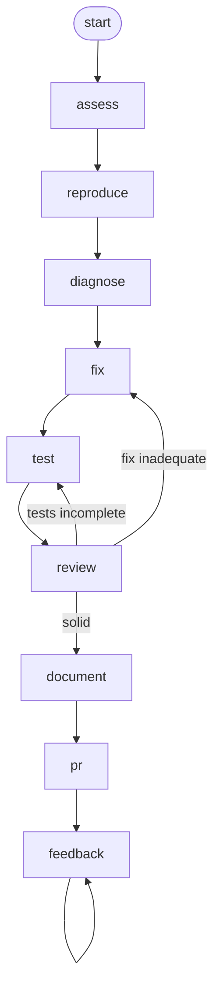

<!-- Edited by Claude Code -->
# Bugfix

A systematic workflow for analyzing, fixing, and verifying software bugs. Guides developers through the complete bug resolution lifecycle from reproduction to release.

## Phase Flow



## Overview

- **Systematic Process**: Structured methodology from reproduction to PR submission
- **Root Cause Focus**: Emphasizes understanding *why* bugs occur, not just *what* happens
- **Comprehensive Testing**: Ensures fixes work and prevents regression
- **Complete Documentation**: Creates all artifacts needed for release and future reference

## Directory Structure

```text
bugfix/
├── commands/             # Slash commands (thin wrappers → skills)
│   ├── start.md
│   ├── assess.md
│   ├── diagnose.md
│   ├── document.md
│   ├── fix.md
│   ├── pr.md
│   ├── reproduce.md
│   ├── review.md
│   ├── test.md
│   ├── feedback.md
│   └── unattended.md
├── skills/               # Detailed process definitions
│   ├── start.md
│   ├── assess.md
│   ├── controller.md
│   ├── diagnose.md
│   ├── document.md
│   ├── feedback.md
│   ├── fix.md
│   ├── pr.md
│   ├── reproduce.md
│   ├── review.md
│   ├── test.md
│   └── unattended.md
├── guidelines.md         # Principles, hard limits, safety, and quality rules
├── SKILL.md              # Entry point for the workflow
└── README.md
```

## Phases

### Phase 0: Start (`/start`)

Present the available workflow phases and help the user choose the right starting point.

- Show all available phases with descriptions and guidance
- Ask the user what context they have (issue URL, error message, known root cause)
- Recommend the best starting phase

### Phase 1: Assess (`/assess`)

Read the bug report, build understanding, and propose a plan.

- Gather the bug report (issue URL, conversation context, attachments)
- Summarize understanding: what the bug is, where it occurs, severity
- Identify gaps and assumptions
- Propose a reproduction plan

**Output**: Assessment presented inline (no file artifact).

### Phase 2: Reproduce (`/reproduce`)

Systematically reproduce the bug and document observable behavior.

- Parse bug reports and extract key information
- Set up environment matching bug conditions
- Attempt reproduction with variations
- Document minimal reproduction steps

**Output**: `.artifacts/bugfix/{issue}/reproduction.md`

### Phase 3: Diagnose (`/diagnose`)

Perform root cause analysis and assess impact.

- Review reproduction report and understand failure conditions
- Analyze code paths and trace execution flow
- Examine git history and recent changes
- Form and test hypotheses about root cause

**Output**: `.artifacts/bugfix/{issue}/root-cause.md`

### Phase 4: Fix (`/fix`)

Implement the bug fix following best practices.

- Review fix strategy from diagnosis phase
- Create feature branch
- Implement minimal code changes
- Run linters and formatters

**Output**: Modified code files + `.artifacts/bugfix/{issue}/implementation-notes.md`

### Phase 5: Test (`/test`)

Verify the fix and create regression tests.

- Create regression test that fails without fix, passes with fix
- Write comprehensive unit tests for modified code
- Run integration tests in realistic scenarios
- Execute full test suite to catch side effects

**Output**: New test files + `.artifacts/bugfix/{issue}/verification.md`

### Phase 6: Review (`/review`) — Optional

Critically evaluate the fix and its tests.

**Verdicts**:

- **Fix is inadequate** → Recommend going back to `/fix`
- **Tests are incomplete** → Provide instructions for additional testing
- **Fix and tests are solid** → Proceed to `/document` and `/pr`

**Output**: `.artifacts/bugfix/{issue}/review.md`

### Phase 7: Document (`/document`)

Create complete documentation for the fix — release notes, CHANGELOG, PR description.

**Output**: `.artifacts/bugfix/{issue}/` containing issue updates, release notes, changelog entries, PR description.

### Phase 8: PR (`/pr`)

Create a pull request to submit the bug fix.

**Output**: A draft pull request URL.

### Phase 9: Feedback (`/feedback`)

Address PR review feedback across sessions.

- Gather review comments from a PR, task file, or user input
- Recover context from prior session artifacts
- Implement targeted changes addressing reviewer feedback
- Track declined suggestions with rationale

**Output**: Modified code files + updated session context.

### Unattended (`/unattended`)

Run the workflow autonomously from `/diagnose` through `/document` without human interaction. Designed for bots and CI pipelines.

## Artifacts

```text
.artifacts/bugfix/{issue}/
├── reproduction.md           # Bug reproduction report
├── root-cause.md             # Root cause analysis
├── implementation-notes.md   # Implementation notes
├── verification.md           # Test results and verification
├── review.md                 # Review findings and verdict
├── issue-update.md           # Text for issue/ticket comment
├── release-notes.md          # Release notes entry
├── changelog-entry.md        # CHANGELOG addition
├── pr-description.md         # Pull request description
├── session-context.md        # Cross-session context (unattended)
└── comment-responses.json    # PR comment reply summaries (feedback)
```

## Getting Started

```bash
./install.sh claude --workflows bugfix
```
