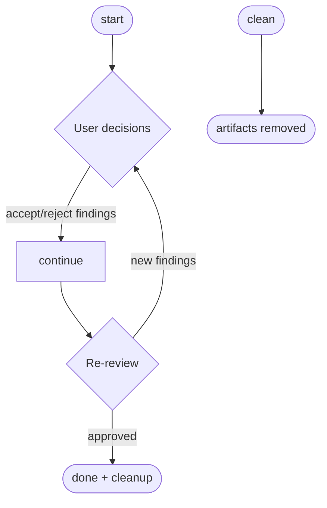

<!-- Edited by Claude Code -->
# Code Review

An AI-driven code review workflow that reviews uncommitted changes, presents findings for human decision, and iterates until approved or the user declares done.

## Phase Flow



## Prerequisites

| Tool | Required | Purpose |
|------|----------|---------|
| Git | Yes | Diff analysis, branch detection |

No external services (Jira, GitHub CLI) are required. The workflow operates entirely on local uncommitted changes.

## Phases

| Phase | Command | Purpose | Artifact(s) |
|-------|---------|---------|-------------|
| Start | `/start` | Discover project, review changes, present findings | `00-reviewer-profile.md`, `01-change-summary.md`, `code-review-001.md`, `review-metadata.json`, `decisions-001.json` |
| Continue | `/continue` | Implement accepted changes, re-review | `review-response-{NNN}.md`, `code-review-{NNN}.md`, `decisions-{NNN}.json` |
| Clean | `/clean` | Remove artifacts from abandoned reviews | (removes artifact directory) |

## Typical Flow

```text
/start [optional focus guidance]
  -> discovers project conventions
  -> analyzes uncommitted changes
  -> obtains a structured code review
  -> presents a decision table for user approval

/continue
  -> implements accepted changes
  -> runs lint/tests if discoverable
  -> obtains a fresh re-review
  -> repeat until approved

/clean (only for abandoned reviews)
  -> removes .artifacts/code-review/{branch}/
```

## The Decision Table

After each review round, findings are presented with both the reviewer's finding and the implementor's independent assessment:

```text
| # | Severity | Category | Finding | Implementor Assessment | Recommendation |
|---|----------|----------|---------|----------------------|----------------|
| 1 | HIGH | Correctness | Missing nil check | Agree | Accept |
| 2 | MEDIUM | Conventions | Use constants | Disagree | Reject |
```

## Optional Focus Guidance

```text
/start focus on error handling and security
/start ignore the test file changes, focus on the API layer
/start this is a refactor -- check for behavioral changes
```

## Unattended Mode

For fully automated review cycles:

```text
/start --unattended
/start --unattended focus on error handling
```

**Safety guardrail:** If the implementor disagrees with a CRITICAL finding, the workflow stops and escalates to the user.

## Artifacts

```text
.artifacts/code-review/{branch}/
  00-reviewer-profile.md
  01-change-summary.md
  review-metadata.json
  decisions-001.json
  code-review-001.md
  review-response-001.md
  code-review-002.md
  ...
```

## Getting Started

```bash
./install.sh claude --workflows code-review
```
