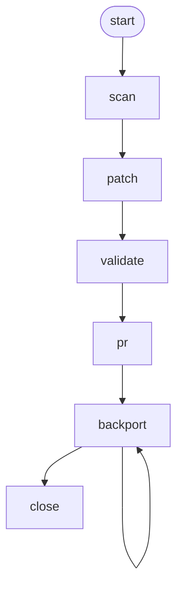

<!-- Edited by Claude Code -->
# CVE Fix

Automated CVE remediation that reads vulnerability details from a Jira ticket, applies multi-strategy dependency fixes, validates results, and creates pull requests with full justification. Language-agnostic.

## Phase Flow



## Prerequisites

- **Jira access** — via Jira MCP server or Jira CLI
- **Python 3.10+** — for helper scripts
- **Vulnerability scanners** (optional): `govulncheck`, `npm audit`, `pip-audit`
- **`skopeo`** — for container image verification (optional)
- **`gh` CLI** — for pull requests (optional)
- **git** — for branch and commit operations

## Phases

| Phase | Command | What it does |
|-------|---------|--------------|
| Start | `/start` | Research Jira vulnerability ticket, gather context, detect ecosystem |
| Scan | `/scan` | Scan repository to confirm CVE is present |
| Patch | `/patch` | Apply multi-strategy fixes with justification logging |
| Validate | `/validate` | Verify dependency updated, run tests |
| PR | `/pr` | Create pull request with strategy justification |
| Backport | `/backport` | Cherry-pick merged fix to release branches (repeatable) |
| Close | `/close` | Verify PR(s) merged, update Jira tickets |

## Multi-Strategy Patching

The `/patch` phase tries fixes in ascending order of risk:

1. **Direct update (minor/patch)** — nearest fixed version within same major
2. **Transitive dependency update** — update a direct dependency that pulls in the vulnerable package
3. **Override/pin mechanism** — language-specific overrides (Go `replace`, npm `overrides`, Maven `dependencyManagement`)
4. **Major version update** — new major version (requires user approval)

## Supported Ecosystems

| Ecosystem | Manifest | Override Mechanism |
|-----------|----------|--------------------|
| Go | `go.mod` | `replace` directive |
| Node.js | `package.json` | `overrides`/`resolutions` |
| Python | `requirements.txt`/`pyproject.toml` | constraints/explicit pin |
| Java (Maven) | `pom.xml` | `<dependencyManagement>` |
| Java (Gradle) | `build.gradle` | `constraints` block |
| Rust | `Cargo.toml` | `[patch]` section |
| Ruby | `Gemfile` | direct version pin |

## Artifacts

```text
.artifacts/cve-fix/{context}/
├── context.md              # Jira research, CVE details, ecosystem
├── scan-result.json        # Machine-readable scan verdict
├── scan-results.md         # Human-readable scan verdict
├── patch-log.md            # Strategy attempts and justifications
├── pr-description.md       # Draft PR body
├── validation-results.md   # Dependency verification, test results
├── backport-log.md         # Backport attempts per release branch
└── close-report.md         # Merged PR summary, Jira updates
```

## Example: Fixing a Go CVE

```text
/start EDM-1234
  → Reads Jira ticket, extracts CVE details
  → Detected ecosystem: Go (go.mod)

/scan
  → Runs govulncheck, confirms CVE is present

/patch
  → Strategy 1 (direct update): go get helm.sh/helm/v3@v3.15.0 → Success

/validate
  → Post-fix scan confirms CVE resolved
  → Tests: PASS

/pr
  → Draft PR created with strategy justification

/backport
  → Cherry-pick to release-2.16

/close
  → All PRs merged, Jira tickets updated
```

## Getting Started

```bash
./install.sh claude --workflows cve-fix
```
