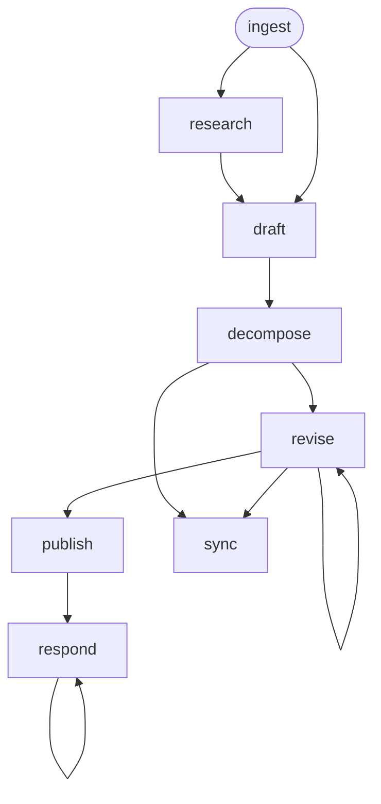

<!-- Edited by Claude Code -->
# Design

A design-and-decompose workflow that ingests a PRD, researches the problem space, drafts a technical design document, decomposes into Jira-ready epics and stories, publishes as a GitHub PR, and syncs to Jira.

## Phase Flow



## Prerequisites

| Tool | Required | Purpose |
|------|----------|---------|
| Jira access (MCP or CLI) | For `/ingest`, `/sync` | Fetch Feature issue, create epics/stories |
| GitHub CLI (`gh`) | For `/publish`, `/respond` | Create PRs, post review comments |
| Web search and URL fetching | For `/research` | Investigate problem space |
| Git | Yes | Branch management, commits |

## Phases

| Phase | Command | Purpose | Artifact(s) |
|-------|---------|---------|-------------|
| Ingest | `/ingest` | Read PRD, explore codebase | `01-context.md` |
| Research | `/research` | Investigate problem space | `02-research.md` |
| Design | `/draft` | Draft design document | `03-design.md` |
| Decompose | `/decompose` | Break into epics and stories | `04-epics.md`, `05-stories/`, `06-coverage.md` |
| Revise | `/revise` | Incorporate feedback | Updated design and/or stories |
| Publish | `/publish` | Post design doc as GitHub PR | `07-pr-description.md` |
| Respond | `/respond` | Address reviewer comments | `08-review-responses.md` |
| Sync | `/sync` | Create Jira epics and stories | `sync-manifest.json` |

## Design Document Template

1. Overview
2. Goals and Non-Goals
3. Motivation / Background
4. Design (Architecture, Data Model, API, Scalability, Security, Failure Handling, RBAC, Extensibility)
5. Alternatives Considered
6. Observability and Monitoring
7. Impact and Compatibility
8. Open Questions

## Task Decomposition

Follows the Jira hierarchy:

- **Feature** (exists in Jira — input)
    - **Epic** — user-value oriented, standalone, T-shirt sized
        - **Story** — right-sized, prefixed with `[DEV]`/`[UI]`/`[UX]`/`[QE]`/`[DOCS]`/`[CI]`

Key constraints:

- Each epic delivers complete functionality independently
- Each story leaves the system in a stable state
- Every `[DEV]` story includes both functionality and testing
- A coverage matrix ensures all PRD requirements are addressed

## Jira Sync

The `/sync` phase creates Jira issues from the approved decomposition:

- **Dry-run first** — always previews what would be created
- **Batch creation** — epics first, then stories per epic
- **Idempotent** — tracks created issues in `sync-manifest.json`
- **Create-only** — never modifies or deletes existing Jira issues

## Artifacts

```text
.artifacts/design/{issue-number}/
  01-context.md
  02-research.md
  03-design.md
  04-epics.md
  05-stories/
    epic-1-image-building.md
    epic-1/
      story-01-scaffold-pipeline.md
      story-02-add-validation.md
  06-coverage.md
  07-pr-description.md
  08-review-responses.md
  sync-manifest.json
```

## Getting Started

```bash
./install.sh claude --workflows design
```
