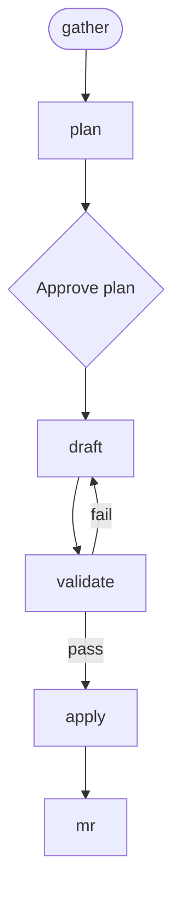

<!-- Edited by Claude Code -->
# Docs Writer

A structured workflow for creating and updating technical documentation in AsciiDoc. Guides writers through the complete documentation lifecycle from feature research to repository integration.

## Phase Flow



## Overview

- **Research-Driven**: Gathers context from Jira tickets, GitHub issues, or text descriptions
- **Structure-First**: Plans where content belongs in the repository before drafting
- **Style-Compliant**: Enforces Red Hat style guidelines and AsciiDoc conventions
- **Validated Output**: Runs Vale linting before applying changes

## Prerequisites

| Tool | Used By | Required? |
|------|---------|-----------|
| **Jira MCP** | `/gather` | Required for Jira ticket input |
| **GitHub MCP** or **`gh` CLI** | `/gather` | Required for GitHub issues |
| **Vale** | `/draft`, `/validate` | Required |
| **Asciidoctor** | `/draft`, `/validate` | Required |
| **`glab` CLI** | `/mr` | Required for merge request creation |
| **`git`** | `/mr` | Required |

## Phases

### Phase 1: Gather Context (`/gather`)

Collect requirements from Jira tickets, GitHub issues, or text descriptions. Navigate the Jira hierarchy and fetch code diffs.

**Output**: `.artifacts/${ticket_id}/01-context.md`

### Phase 2: Plan Structure (`/plan`)

Determine where new documentation lives in the repository. Review existing content and create a structural plan.

**Output**: `.artifacts/${ticket_id}/02-plan.md`

### Phase 3: Draft Content (`/draft`)

Write style-compliant AsciiDoc documentation. Uses product name attributes, follows Red Hat Modular Documentation patterns, runs Vale inline.

**Output**: `.artifacts/${ticket_id}/03-final-docs.adoc`

### Phase 4: Validate (`/validate`)

Run Vale on each file segment and optionally AsciiDoctor builds. Loops back to `/draft` on failure.

### Phase 5: Apply Changes (`/apply`)

Write validated content to actual repository files. Update `master.adoc` includes for new topic files.

### Phase 6: Create Merge Request (`/mr`)

Create a GitLab merge request for documentation changes via `glab mr create`.

**Output**: A draft merge request on GitLab.

## Artifacts

```text
.artifacts/${ticket_id}/
├── 01-context.md          # Feature research and context
├── 02-plan.md             # Structural plan
├── 03-final-docs.adoc     # Style-compliant, validated AsciiDoc
└── 04-mr-description.md   # MR description
```

## Getting Started

```bash
./install.sh claude --workflows docs-writer
```
