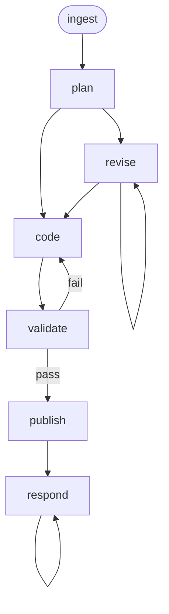

<!-- Edited by Claude Code -->
# Implement

A story-to-code workflow that takes a Jira Story, plans the implementation, writes contract-based tests and production code via TDD, validates against the project's CI expectations, and manages review via GitHub PRs.

## Phase Flow



## Prerequisites

| Tool | Required | Purpose |
|------|----------|---------|
| Jira access (MCP or CLI) | For `/ingest` | Fetch Story issue details |
| GitHub CLI (`gh`) | For `/publish`, `/respond` | Create PRs, post review comments |
| Git | Yes | Branch management, commits |
| Project build/test tooling | Yes | Discovered during `/ingest` |

## Phases

| Phase | Command | Purpose | Artifact(s) |
|-------|---------|---------|-------------|
| Ingest | `/ingest` | Fetch story, load context, explore codebase | `01-context.md` |
| Plan | `/plan` | Design implementation approach and test strategy | `02-plan.md` |
| Revise | `/revise` | Incorporate feedback into the plan | Updated `02-plan.md` |
| Code | `/code` | Write tests and code via TDD | `03-test-report.md`, `04-impl-report.md` |
| Validate | `/validate` | Run tests, lint, coverage analysis | `05-validation-report.md` |
| Publish | `/publish` | Push branch, create draft PR | `06-pr-description.md` |
| Respond | `/respond` | Address reviewer comments | `07-review-responses.md` |

## Key Design Decisions

### Contract-Based Testing

Tests validate behavioral contracts through public interfaces:

- Every behavioral path reachable through a public function gets its own test case
- Tests should remain valid if the implementation were rewritten
- Unit tests are always required; integration tests when component interactions are involved
- Low coverage through public APIs is a design signal for decomposition

### Discovery-Based Validation

The workflow discovers the project's validation expectations from AGENTS.md, Makefile, and CI workflows during `/ingest`. No hardcoded language-specific commands.

### Plan as Living Document

`02-plan.md` is updated during `/code` as tasks complete. On re-invocation, the plan shows progress.

## Artifacts

```text
.artifacts/implement/{jira-key}/
  01-context.md
  02-plan.md
  03-test-report.md
  04-impl-report.md
  05-validation-report.md
  06-pr-description.md
  07-review-responses.md
  publish-metadata.json
```

## Getting Started

```bash
./install.sh claude --workflows implement
```
