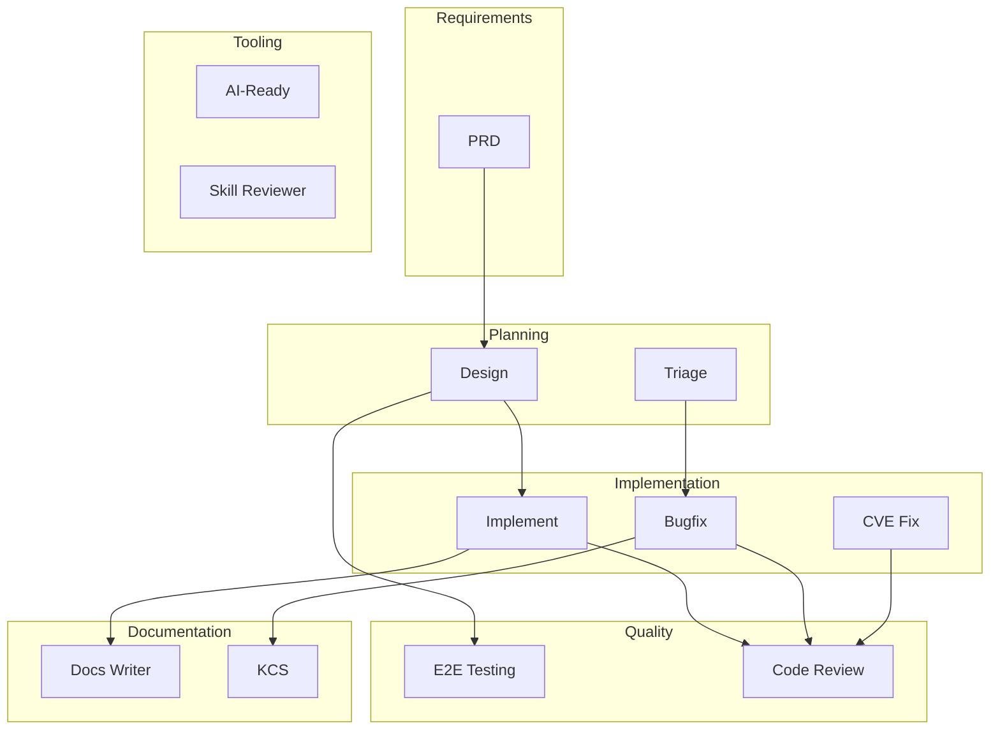

<!-- Edited by Claude Code -->
# Workflows Overview

AI Workflows provides 12 production-ready workflows covering the full software development lifecycle.

## SDLC Coverage



## Workflow Catalog

| Workflow | Phases | Purpose |
|----------|--------|---------|
| [Bugfix](bugfix.md) | assess, reproduce, diagnose, fix, test, review, document, pr, feedback | Systematic bug resolution |
| [Code Review](code-review.md) | start, continue, clean | AI-driven code review with human decisions |
| [CVE Fix](cve-fix.md) | start, scan, patch, validate, pr, backport, close | Automated CVE remediation |
| [Design](design.md) | ingest, research, draft, decompose, revise, publish, respond, sync | Technical design and Jira decomposition |
| [Docs Writer](docs-writer.md) | gather, plan, draft, validate, apply, mr | Documentation creation and validation |
| [E2E Testing](e2e.md) | ingest, plan, revise, code, validate, publish, respond | Story-to-tests for QE stories |
| [Implement](implement.md) | ingest, plan, revise, code, validate, publish, respond | Story-to-code via TDD |
| [KCS](kcs.md) | gather, draft, validate, handoff | KCS Solution article workflow |
| [PRD](prd.md) | ingest, clarify, draft, revise, publish, respond | Requirements to PRD |
| [Triage](triage.md) | start, scan, analyze, report, assess | Bulk Jira bug triage |
| [AI-Ready](ai-ready.md) | update | AGENTS.md generation |
| [Skill Reviewer](skill-reviewer.md) | review | AI skill quality auditing |

## Architecture

Every workflow follows a canonical structure:

```text
workflow-name/
  SKILL.md              # Entry point with YAML frontmatter
  guidelines.md         # Behavioral rules and guardrails
  README.md             # Human-readable documentation
  skills/
    controller.md       # Optional phase dispatcher
    phase-name.md       # Implementation for each phase
  commands/
    phase-name.md       # Thin wrappers for slash commands
```

Key principles:

- **Auto-discovery**: Any directory with `SKILL.md` is discovered by the installer
- **Progressive disclosure**: `SKILL.md` is thin (under 30 lines), details live in `guidelines.md` and `skills/`
- **Relative paths**: All file references are relative for symlink compatibility
- **Phase-based execution**: Discrete phases with explicit transitions
- **No auto-advance**: Workflows wait for user input between phases
