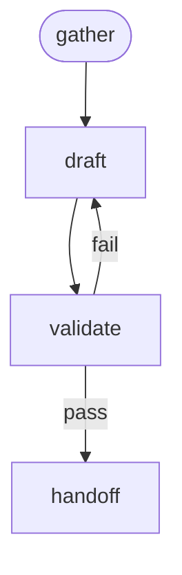

<!-- Edited by Claude Code -->
# KCS

A structured workflow for creating KCS (Knowledge-Centered Service) Solution articles. Guides writers through gathering bug context, drafting the article, validating against the KCS Content Standard, and preparing a handoff message.

## Phase Flow



## Overview

- **Context-Driven**: Gathers bug details from Jira and user-provided workaround steps
- **Template-Based**: Uses a KCS Solution skeleton and per-section writing guidance
- **Validated Output**: Checks the draft against a comprehensive KCS checklist
- **Portable**: No hardcoded product names, contacts, or project references

## Prerequisites

| Tool | Used By | Required? |
|------|---------|-----------|
| **Jira MCP** | `/gather` | Required for Jira ticket input |
| **Git** | General | Recommended |

## Phases

### Phase 1: Gather Context (`/gather`)

Fetch bug details from Jira. Merge user-provided context (workaround steps, logs, diagnostic commands). Identify information gaps.

**Output**: `.artifacts/kcs/{issue-key}/01-context.md`

### Phase 2: Draft Article (`/draft`)

Write a KCS Solution article using the template. Fill in Title, Issue, Environment, Diagnostic Steps, Resolution, Root Cause. Apply KCS style rules.

**Output**: `.artifacts/kcs/{issue-key}/02-kcs-draft.md`

### Phase 3: Validate (`/validate`)

Run every item in the validation checklist. Auto-fix minor issues. Report issues requiring user input.

**Output**: Updated `.artifacts/kcs/{issue-key}/02-kcs-draft.md`

### Phase 4: Handoff (`/handoff`)

Compose a message for the support engineer who publishes the article.

**Output**: `.artifacts/kcs/{issue-key}/03-handoff-message.md`

## Artifacts

```text
.artifacts/kcs/{issue-key}/
├── 01-context.md          # Bug details and user-provided context
├── 02-kcs-draft.md        # The KCS Solution article
└── 03-handoff-message.md  # Ready-to-send message for the support engineer
```

## Getting Started

```bash
./install.sh claude --workflows kcs
```
