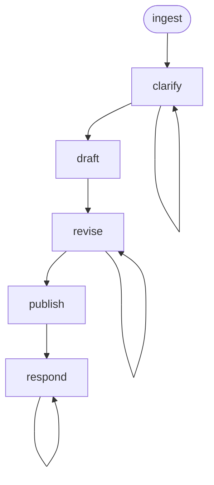

<!-- Edited by Claude Code -->
# PRD

A requirements-to-PRD workflow that ingests requirements from Jira, clarifies ambiguities through iterative Q&A, drafts a Product Requirements Document, revises based on feedback, publishes as a GitHub PR, and responds to reviewer comments.

## Phase Flow



## Prerequisites

| Tool | Required | Purpose |
|------|----------|---------|
| Jira access (MCP or CLI) | For `/ingest` | Fetch requirements from Jira |
| GitHub CLI (`gh`) | For `/publish`, `/respond` | Create PRs, post review comments |
| Git | Yes | Branch management, commits |

## Phases

| Phase | Command | Purpose | Artifact |
|-------|---------|---------|----------|
| Ingest | `/ingest` | Fetch requirements from Jira | `01-requirements.md` |
| Clarify | `/clarify` | Iterative Q&A to resolve gaps | `02-clarifications.md` |
| Draft | `/draft` | Generate PRD from template | `03-prd.md` |
| Revise | `/revise` | Incorporate user feedback | `03-prd.md` (updated) |
| Publish | `/publish` | Post as GitHub PR | `04-pr-description.md` |
| Respond | `/respond` | Address reviewer comments | `05-review-responses.md` |

## PRD Template

1. Problem Statement
2. Goals and Non-Goals (including Success Metrics)
3. Requirements (Functional and Non-Functional)
4. Acceptance Criteria
5. Dependencies
6. Risks
7. Open Questions

## Project-Level Template Override

Projects can customize the PRD template:

1. Path specified in the project's `CLAUDE.md` or `AGENTS.md`
2. `.prd/templates/prd.md` at the project root
3. Workflow's built-in template (fallback)

## Artifacts

All artifacts stored in `.artifacts/prd/{issue-number}/`.

## Getting Started

```bash
./install.sh claude --workflows prd
```
