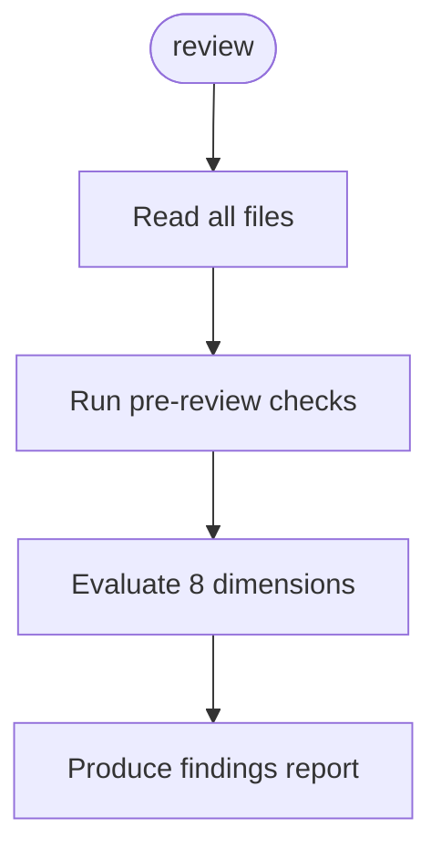

<!-- Edited by Claude Code -->
# Skill Reviewer

A structured workflow for reviewing AI skill directories. Evaluates structure, clarity, completeness, and consistency — then produces a findings report with actionable suggestions.

## Phase Flow



## Overview

- **8 Review Dimensions**: Orchestration, sequencing, schemas, cognitive load, clarity, documentation, naming, error handling
- **Severity Classification**: CRITICAL, HIGH, MEDIUM, LOW
- **Actionable Output**: Every finding includes a concrete suggestion
- **Read-Only**: The review never modifies the target skill's files

## Review Process

1. Read all files in the target skill directory
2. Run automated pre-review checks (`scripts/pre-review-checks.py`)
3. Evaluate against 8 dimensions:
    - **Orchestration & Routing** — correct routing, no orphaned references
    - **Step Sequencing & Numbering** — sequential numbering, correct cross-references
    - **Schema Consistency** — matching field names/types across files
    - **Cognitive Load & Context Risk** — step count, batching, synthesis placement
    - **Instruction Clarity** — unambiguous, first-try-correct instructions
    - **Documentation & Project Alignment** — README matches implementation
    - **Command Naming** — consistent, self-explanatory names
    - **Error Handling & Edge Cases** — failure modes documented
4. Classify findings and produce a structured report

## Severity Levels

| Severity | Meaning | Classification |
|----------|---------|----------------|
| CRITICAL | Skill would produce wrong output or fail | Blocker |
| HIGH | Skill would produce degraded output | Blocker |
| MEDIUM | Quality issue, documentation drift | Suggestion |
| LOW | Polish, readability, minor wording | Suggestion |

## Artifacts

```text
.artifacts/skill-reviewer/{skill-name}/
├── file-hashes.json    # SHA-256 hashes for change detection
├── skill-map.md        # Structured skill map
└── review.md           # Full review report with findings
```

## Directory Structure

```text
skill-reviewer/
├── commands/
│   └── review.md
├── prompts/
│   └── analyze-skill.md
├── scripts/
│   └── pre-review-checks.py
├── skills/
│   └── review.md
├── guidelines.md
├── SKILL.md
└── README.md
```

## Getting Started

```bash
./install.sh claude --workflows skill-reviewer
```

Then run `/review <skill-name>` to review a skill directory.
