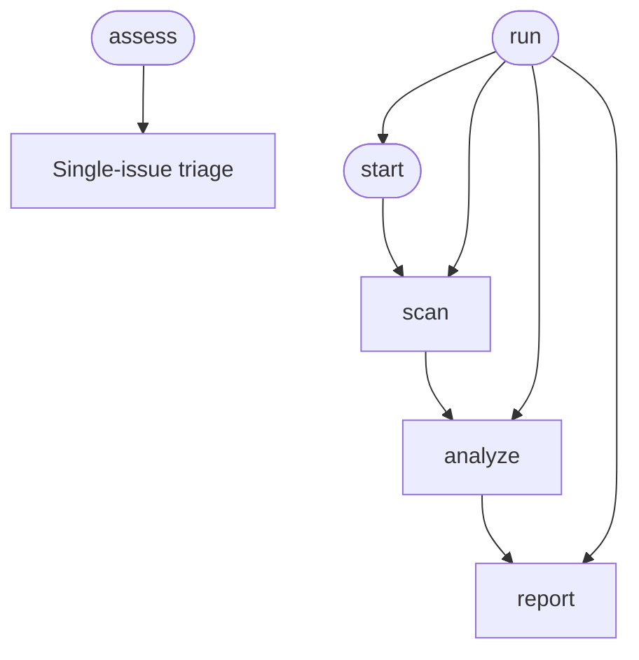

<!-- Edited by Claude Code -->
# Triage

Bulk-triage unresolved Jira bugs with AI-driven recommendations. Fetches all open bugs and recently resolved bugs, analyzes each, and generates a self-contained interactive HTML report.

## Phase Flow



## Prerequisites

- **Jira MCP server** — configured and authenticated
- **Jira access** — read access to the target project

## Phases

| Phase | Command | What it does |
|-------|---------|--------------|
| Run | `/run` | Execute all bulk phases end-to-end |
| Start | `/start` | Validate Jira access, confirm project key |
| Scan | `/scan` | Fetch unresolved + recently resolved bugs |
| Analyze | `/analyze` | Categorize each bug with AI recommendations |
| Report | `/report` | Generate interactive HTML report |
| Assess | `/assess` | Full triage of one issue (not part of bulk pipeline) |

## Recommendation Types

| Type | Description |
|------|-------------|
| CLOSE | Invalid, obsolete, or stale with vague description |
| FIX_NOW | Critical/high priority, blockers, regressions, quick wins |
| AUTO_FIX | Well-described bug suitable for automated bugfix bot |
| BACKLOG | Valid but not urgent |
| NEEDS_INFO | Missing reproduction steps or unclear description |
| DUPLICATE | Appears to duplicate another issue |
| ESCALATE | Needs architectural decision or cross-team coordination |
| WONT_FIX | Valid but out of scope or cost-prohibitive |

## HTML Report Features

The generated report is a single HTML file with Material Design styling, inline CSS/JS, and embedded data.

### Overview

- Total bugs card, stats dashboard, executive summary
- Release risk assessment with color-coded risk levels

### Analysis

- Recommendation legend, key recommendations
- Priority breakdown, status distribution
- Assignee load, aging analysis

### Issue Details

- Stale bugs table, priority mismatches
- Possible regressions, duplicate clusters
- All Issues table with signature, duplicate %, regression columns

### Interactivity

- Dropdown filters (recommendation, priority, component, assignee)
- Live counter, sortable columns, free-text search
- Simulation mode (strike through CLOSE/WONT_FIX/DUPLICATE)
- Auto-fix likelihood percentage badges

## Artifacts

```text
.artifacts/triage/{project}/
  issues.json        — raw scanned unresolved bugs
  resolved.json      — recently resolved bugs for regression matching
  analyzed.json      — issues with recommendations
  report.html        — interactive HTML dashboard
```

## Usage

```text
/triage:run EDM
```

Or step by step:

```text
/triage:start EDM
/triage:scan
/triage:analyze
/triage:report
```

## Getting Started

```bash
./install.sh claude --workflows triage
```
